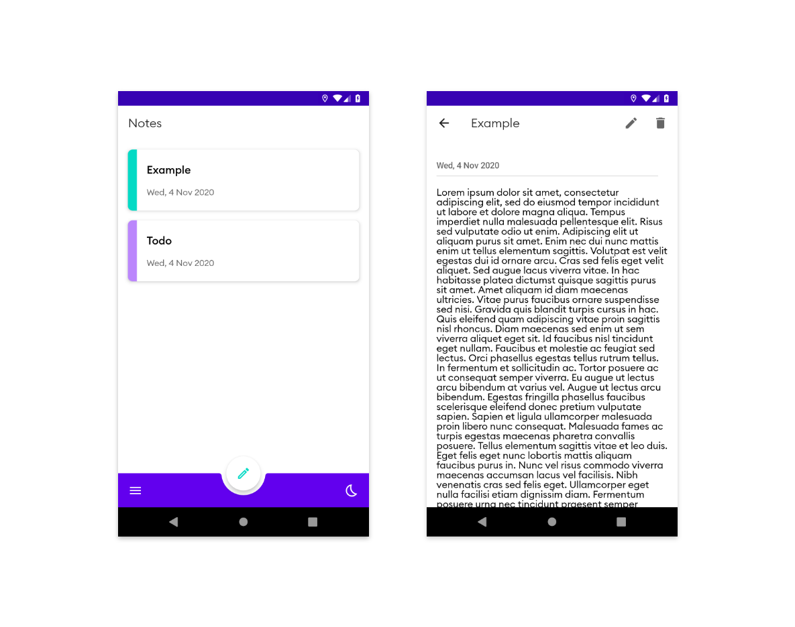

  
 

 

Notes application is sample app based on MVVM architecture.

Work in progress 🚧
-------------------
This app is work in progress.

Build 🛠
-------------------
App has following modules
1. App: contains views and viewModels
1. Data: contains repository and web api
1. Domain: contains use cases and POJO objects

License 📄
-------------------

    Copyright 2020 Alberto Caliman

    Licensed under the Apache License, Version 2.0 (the "License");
    you may not use this file except in compliance with the License.
    You may obtain a copy of the License at

       http://www.apache.org/licenses/LICENSE-2.0

    Unless required by applicable law or agreed to in writing, software
    distributed under the License is distributed on an "AS IS" BASIS,
    WITHOUT WARRANTIES OR CONDITIONS OF ANY KIND, either express or implied.
    See the License for the specific language governing permissions and
    limitations under the License.